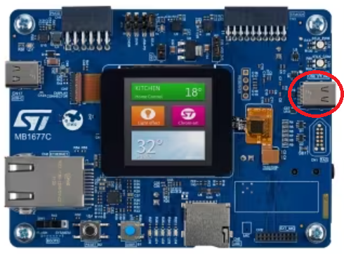
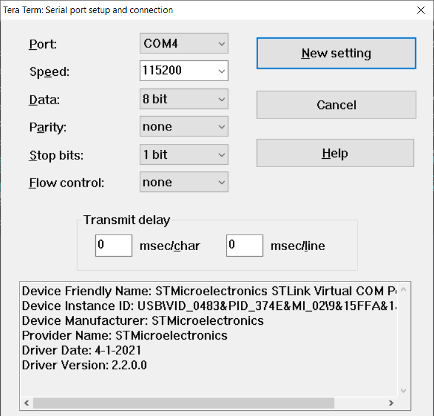
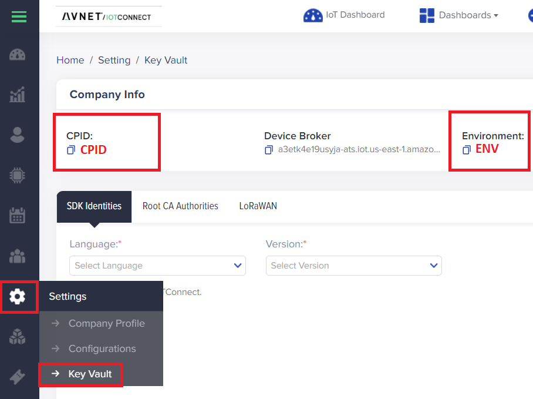
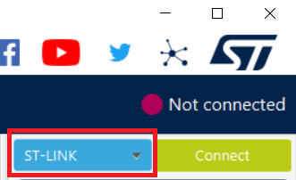
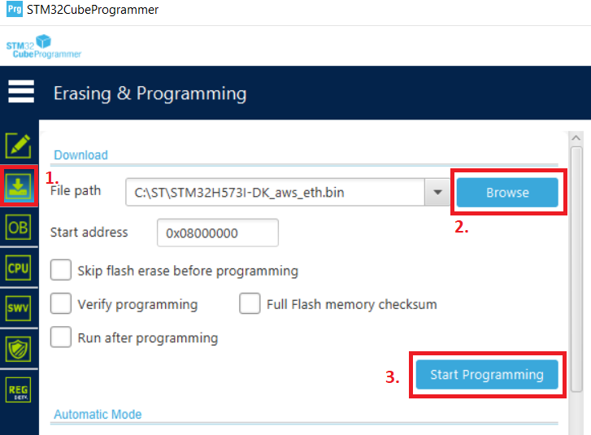

# QuickStart STM32H5 on IoTConnect

## 1. Introduction  
This document provides a step-by-step-guide to program and evaluate the 
[STM32H573IIK3Q Discovery kit](https://www.st.com/en/evaluation-tools/stm32h573i-dk.html) on IoTConnect.
For simplicity, thie guide does not leverage the Cortex-M33 TrustZone and ST’s Secure Manager, but please refer to the [Developer Guide](https://github.com/avnet-iotconnect/avnet-iotconnect.github.io/blob/main/documentation/iotc-freertos-stm32-h5/DEVELOPER_GUIDE.md) for more information on how to setup this feature.

## 2. Required Software  
* Download the pre-built firmware image: [freertos_STM32H573I-DK_aws_eth.bin](https://saleshosted.z13.web.core.windows.net/demo/st/freertos_STM32H573I-DK_aws_eth.bin)
* Download and install the [STM32CubeProgrammer](https://www.st.com/en/development-tools/stm32cubeprog.html) for STM32.
* A serial console application such as [Tera Term](https://sourceforge.net/projects/tera-term/).

## 3. Setup Hardware  
* Connect an Ethernet cable to the board and to a local network.
* Connect a USB cable from your PC to the USB port labled "USB_STLINK" which is on the opposite side of the board as the Ethernet port.  
  

## 4. Configure the Serial Terminal  
* Open TeraTerm and configure the settings as shown in the screenshot below:

* Open a new serial connect and select the COM port which contains "STMicroelectronics" in the name.

## 5. Setup an IoTConnect Cloud Account
This guide requires an IoTConnect account on AWS.

>**NOTE:**  
> If you have already created an IoTConnect account on AWS you may skip this section.

If you need to create an account, a free trial subscription is available.
Please follow the 
[Creating a New IoTConnect Account](https://github.com/avnet-iotconnect/avnet-iotconnect.github.io/blob/main/documentation/iotconnect/subscription/subscription.md)
guide and ensure to select the [AWS version](https://subscription.iotconnect.io/subscribe?cloud=aws) during registration:


## 6. Obtain CPID and ENV
* Log in to your IoTConnect on AWS Account here:  [https://console.iotconnect.io](https://console.iotconnect.io)  
* Click the Settings Icon, then click "Key Vault" and copy both the CPID and ENV for later use:
  

## 7. Device Setup  
### 7.1 Flash Firmware  

* Launch the STM32CubeProgrammer
* In STM32CubeProgrammer ensure "ST-LINK" is selected as the connection method in the top right:  
  
* Click **Connect** next to this drop-down
* Click the 2nd icon down on the left side to open the "Erasing & Programming Screen"
* Click **Browse** and select the firmware file downloaded earlier
* Click **Start Programming**  
  

* Once the flashing is reported as complete, click the  "Disconnect" button in the top-right corner.  
* Press the black reset button next to the blue button to reset the board.  

### 7.2 Configure Device
Once the board has reset, switch back to the serial terminal to configure the device.  
* Enter `help` into the serial terminal and ensure there is a response.  

1. Copy/Paste the code snippet below into the terminal and append a **device_name** your choice and press `Enter`.  
> **Note:** The device name may only contain letters, numbers and hyphens ("-").  

Example of command: `conf set thing_name <device_name>`  
```
conf set thing_name
```  
(Take note of your **device_name** as it will be used later.)  

2. Copy/Paste the code snippet below into the terminal and append the **CPID** variable saved from earlier and press `Enter`.  
Example of command: `conf set cpid MyCPID`
```
conf set cpid
```  

3. Copy/Paste the code snippet below into the terminal and append the **ENV** variable saved from earlier and press `Enter`.  
Example of command: `conf set env MyEnvironment`
```
conf set env
```  

4. Copy/Paste the code snippet below into the terminal and press `Enter` to commit the configuration to memory.
```
conf commit
```  

5. Copy/Paste the code snippet below and press `Enter` to import the AWS Root CA:  
```
pki import cert root_ca_cert
```  

6. If you're working with AWS, copy/paste the contents of this signed AWS Root CA Certificate ["Starfield Services Root Certificate Authority - G2](https://www.amazontrust.com/repository/SFSRootCAG2.pem) into the terminal and hit `Enter`.  
```
-----BEGIN CERTIFICATE-----
MIID7zCCAtegAwIBAgIBADANBgkqhkiG9w0BAQsFADCBmDELMAkGA1UEBhMCVVMx
EDAOBgNVBAgTB0FyaXpvbmExEzARBgNVBAcTClNjb3R0c2RhbGUxJTAjBgNVBAoT
HFN0YXJmaWVsZCBUZWNobm9sb2dpZXMsIEluYy4xOzA5BgNVBAMTMlN0YXJmaWVs
ZCBTZXJ2aWNlcyBSb290IENlcnRpZmljYXRlIEF1dGhvcml0eSAtIEcyMB4XDTA5
MDkwMTAwMDAwMFoXDTM3MTIzMTIzNTk1OVowgZgxCzAJBgNVBAYTAlVTMRAwDgYD
VQQIEwdBcml6b25hMRMwEQYDVQQHEwpTY290dHNkYWxlMSUwIwYDVQQKExxTdGFy
ZmllbGQgVGVjaG5vbG9naWVzLCBJbmMuMTswOQYDVQQDEzJTdGFyZmllbGQgU2Vy
dmljZXMgUm9vdCBDZXJ0aWZpY2F0ZSBBdXRob3JpdHkgLSBHMjCCASIwDQYJKoZI
hvcNAQEBBQADggEPADCCAQoCggEBANUMOsQq+U7i9b4Zl1+OiFOxHz/Lz58gE20p
OsgPfTz3a3Y4Y9k2YKibXlwAgLIvWX/2h/klQ4bnaRtSmpDhcePYLQ1Ob/bISdm2
8xpWriu2dBTrz/sm4xq6HZYuajtYlIlHVv8loJNwU4PahHQUw2eeBGg6345AWh1K
Ts9DkTvnVtYAcMtS7nt9rjrnvDH5RfbCYM8TWQIrgMw0R9+53pBlbQLPLJGmpufe
hRhJfGZOozptqbXuNC66DQO4M99H67FrjSXZm86B0UVGMpZwh94CDklDhbZsc7tk
6mFBrMnUVN+HL8cisibMn1lUaJ/8viovxFUcdUBgF4UCVTmLfwUCAwEAAaNCMEAw
DwYDVR0TAQH/BAUwAwEB/zAOBgNVHQ8BAf8EBAMCAQYwHQYDVR0OBBYEFJxfAN+q
AdcwKziIorhtSpzyEZGDMA0GCSqGSIb3DQEBCwUAA4IBAQBLNqaEd2ndOxmfZyMI
bw5hyf2E3F/YNoHN2BtBLZ9g3ccaaNnRbobhiCPPE95Dz+I0swSdHynVv/heyNXB
ve6SbzJ08pGCL72CQnqtKrcgfU28elUSwhXqvfdqlS5sdJ/PHLTyxQGjhdByPq1z
qwubdQxtRbeOlKyWN7Wg0I8VRw7j6IPdj/3vQQF3zCepYoUz8jcI73HPdwbeyBkd
iEDPfUYd/x7H4c7/I9vG+o1VTqkC50cRRj70/b17KSa7qWFiNyi2LSr2EIZkyXCn
0q23KXB56jzaYyWf/Wi3MOxw+3WKt21gZ7IeyLnp2KhvAotnDU0mV3HaIPzBSlCN
sSi6
-----END CERTIFICATE-----
```  
Otherwise, for use with Azure copy/paste the contents of this signed Root CA Certificate from [DigiCert GLobal Root G2](https://cacerts.digicert.com/DigiCertGlobalRootG2.crt.pem) into the terminal and hit `Enter`. 
```
-----BEGIN CERTIFICATE-----
MIIDjjCCAnagAwIBAgIQAzrx5qcRqaC7KGSxHQn65TANBgkqhkiG9w0BAQsFADBh
MQswCQYDVQQGEwJVUzEVMBMGA1UEChMMRGlnaUNlcnQgSW5jMRkwFwYDVQQLExB3
d3cuZGlnaWNlcnQuY29tMSAwHgYDVQQDExdEaWdpQ2VydCBHbG9iYWwgUm9vdCBH
MjAeFw0xMzA4MDExMjAwMDBaFw0zODAxMTUxMjAwMDBaMGExCzAJBgNVBAYTAlVT
MRUwEwYDVQQKEwxEaWdpQ2VydCBJbmMxGTAXBgNVBAsTEHd3dy5kaWdpY2VydC5j
b20xIDAeBgNVBAMTF0RpZ2lDZXJ0IEdsb2JhbCBSb290IEcyMIIBIjANBgkqhkiG
9w0BAQEFAAOCAQ8AMIIBCgKCAQEAuzfNNNx7a8myaJCtSnX/RrohCgiN9RlUyfuI
2/Ou8jqJkTx65qsGGmvPrC3oXgkkRLpimn7Wo6h+4FR1IAWsULecYxpsMNzaHxmx
1x7e/dfgy5SDN67sH0NO3Xss0r0upS/kqbitOtSZpLYl6ZtrAGCSYP9PIUkY92eQ
q2EGnI/yuum06ZIya7XzV+hdG82MHauVBJVJ8zUtluNJbd134/tJS7SsVQepj5Wz
tCO7TG1F8PapspUwtP1MVYwnSlcUfIKdzXOS0xZKBgyMUNGPHgm+F6HmIcr9g+UQ
vIOlCsRnKPZzFBQ9RnbDhxSJITRNrw9FDKZJobq7nMWxM4MphQIDAQABo0IwQDAP
BgNVHRMBAf8EBTADAQH/MA4GA1UdDwEB/wQEAwIBhjAdBgNVHQ4EFgQUTiJUIBiV
5uNu5g/6+rkS7QYXjzkwDQYJKoZIhvcNAQELBQADggEBAGBnKJRvDkhj6zHd6mcY
1Yl9PMWLSn/pvtsrF9+wX3N3KjITOYFnQoQj8kVnNeyIv/iPsGEMNKSuIEyExtv4
NeF22d+mQrvHRAiGfzZ0JFrabA0UWTW98kndth/Jsw1HKj2ZL7tcu7XUIOGZX1NG
Fdtom/DzMNU+MeKNhJ7jitralj41E6Vf8PlwUHBHQRFXGU7Aj64GxJUTFy8bJZ91
8rGOmaFvE7FBcf6IKshPECBV1/MUReXgRPTqh5Uykw7+U0b6LJ3/iyK5S9kJRaTe
pLiaWN0bfVKfjllDiIGknibVb63dDcY3fe0Dkhvld1927jyNxF1WW6LZZm6zNTfl
MrY=
-----END CERTIFICATE-----
``` 
7. Copy/Paste the code snippet below and press `Enter` to generate a local Private Key:  
```
pki generate key
```  

8. Copy/Paste the code snippet below and press `Enter` to generate a Self-Signed Certificate:  
```
pki generate cert
```  

9. Save the resulting certificate to a file, including the "BEGIN" and "END" lines, named *devicecert.pem*.  

## 8. Configure IoTConnect  
Return to the IoTConnect web portal and complete the following steps:

### 8.1 Create IoTConnect Device Template  
A Device Template with Self Signed authentication type will need to be imported.
* Download the premade [Device Template with Self-Signed Auth](templates/STM32H5ntz_device_template.JSON).
* Import the template into your IoTConnect instance. (A guide on [Importing a Device Template](https://github.com/avnet-iotconnect/avnet-iotconnect.github.io/blob/main/documentation/iotconnect/import_device_template.md) is available.)

### 8.2 Create IoTConnect Device
* Create a new device in the IoTConnect portal. (Follow the [Create a New Device](https://github.com/avnet-iotconnect/avnet-iotconnect.github.io/blob/main/documentation/iotconnect/create_new_device.md) guide for a detailed walkthrough.)
* Enter the **device_name** you selected earlier in the "Unique ID" field and enter description of your choice in the "Display Name" field.
* Select the Entity drop-down and pick the entity displayed.
* Select the template from the dropdown box that was just imported.
* Under "Device certificate" click "Use my certificate"
* Click "Browse" and select the devicecert.pem file you saved previously.
* Click **Save & View** and press the black Reset button on the board.

## 9. Verification  
After about a minute the board will be sending telemetry to the IoTConnect platform.  
* To verify, return to the *Devices* page and click on the newly created Device ID.
* On the left sub-menu, click *Live Data* and after a few seconds, MQTT data should be shown. 

## 10. Visualization
Dashboards are used to easily visualize data.  
* Download the [STM32H5 Dashboard Template](templates/STM32H5_Demo_Dashboard.json) (Right-click and open in new window)  
* Click the **Download** icon to save the file and take note of the location  
* Once downloaded, select "Create Dashboard" from the top of the IoTConnect portal and then choose the "Import Dashboard" option.
* Enter a name for the dashboard (e.g. "STM32H5 Demo Dashboard")  
* Click "Browse" and select the dashboard template (.json) file downloaded previously which will cause two new fields to appear.  
* Select "STM32H5ntz" from the **Template** drop-down  
* Select the unique device name from the **Device** drop-down
* Click **Save** 
