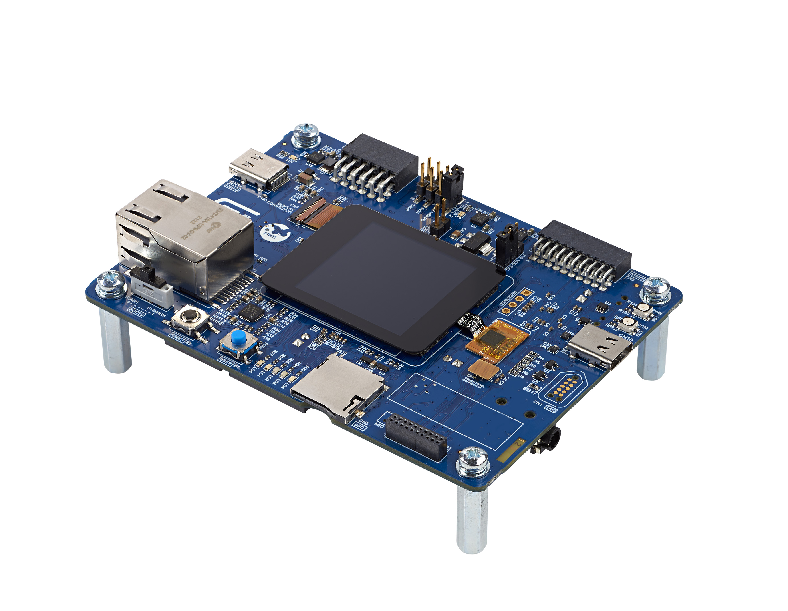

# IoTConnect SDK demo based on X-Cube-FreeRTOS for STM32-H5 boards 

The demo uses the [IoTConnect FreeRTOS RTOS](https://github.com/avnet-iotconnect/iotc-freertos-sdk) 
and provides a sample application to connect [STM32H573I-DK Discovery Kit](https://www.st.com/en/evaluation-tools/stm32h573i-dk.html) to IoTConnect.

The QuickStart Guide below provides a binary image to program the board for quick evaluation of the sample application. 
* [QuickStart Guide](https://github.com/avnet-iotconnect/avnet-iotconnect.github.io/blob/main/documentation/iotc-freertos-stm32-h5/QUICKSTART.md)

Use this Developer Guide to setup the project and modify the source to further develop using the sample application.
* [Developer Guide](https://github.com/avnet-iotconnect/avnet-iotconnect.github.io/blob/main/documentation/iotc-freertos-stm32-h5/DEVELOPER_GUIDE.md)

